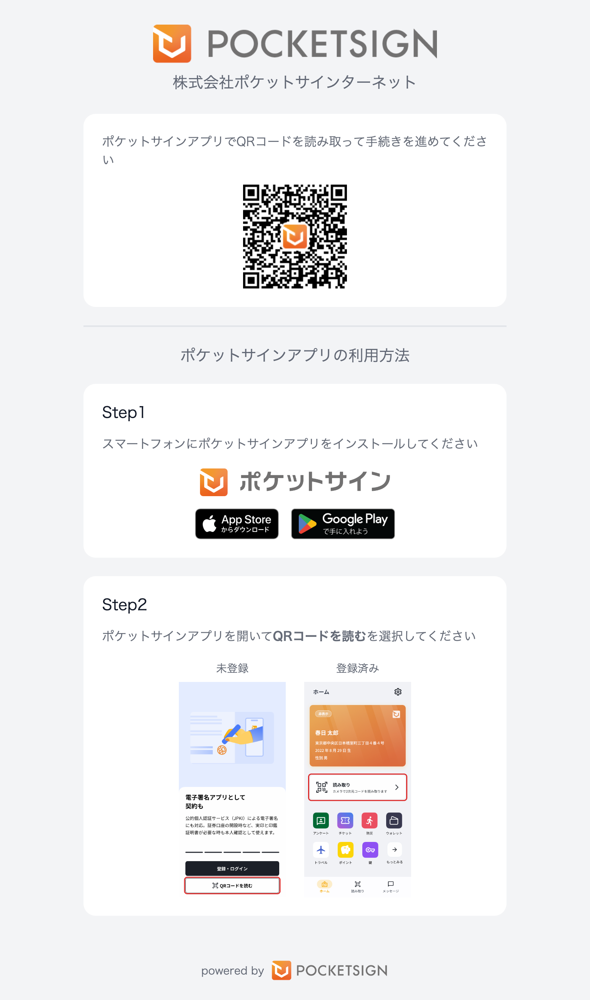
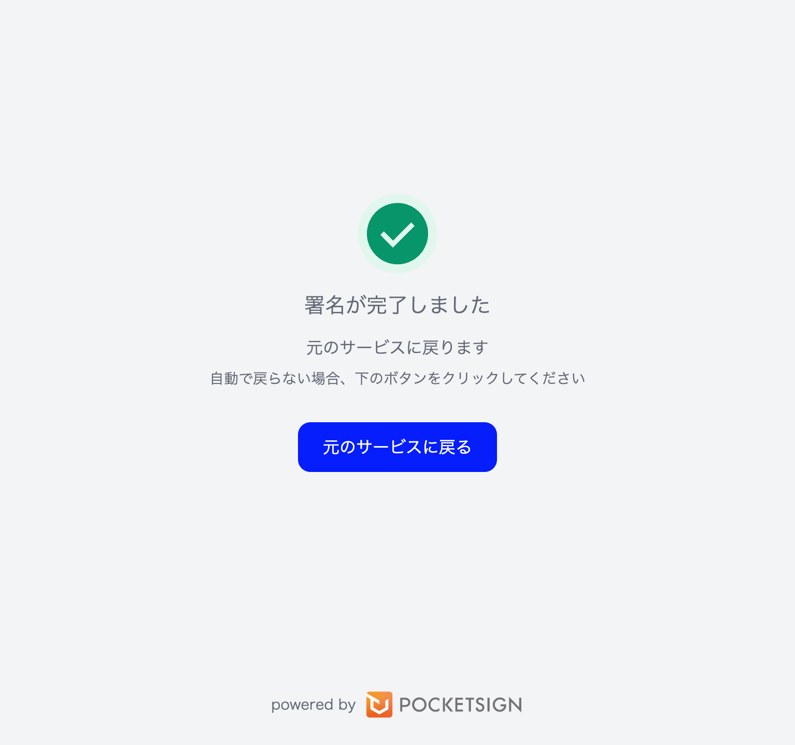

# PocketSign Stampの利用方法

このドキュメントでは、PocketSign Stampの利用方法を説明します。
ポケットサインアプリ、Stamp Webサイト、事業者Webサイトの動作を本サンプルを例に説明します。

## 本サンプルを起動する

### `POCKETSIGN_TOKEN` を設定する

`wrangler.toml` の `POCKETSIGN_TOKEN` を実際の値に差し替える必要があります。

`POCKETSIGN_TOKEN` は、[API の利用開始](https://docs.p8n.app/docs/verify/guide/getting-started/api)を参照して、作成したAPI トークンを設定してください。

### 起動コマンドを実行する

以下のコマンドを実行して、本サンプルを起動します。

```shell
npm i
npm run dev
```

<http://localhost:8787>を開くと、次のような画面が表示されます。


## 事業者WebサイトからStamp Webサイトへリダイレクトする

プランを選択して「申し込む」をクリックすると、次のような画面にリダイレクトされます。



このときの事業者バックエンド側の具体的な処理については `index.tsx` の `/apply` の処理をご参照ください。

## PSアプリ側で署名を行う

### PSアプリをインストールする

開発版ポケットサインの入手方法は担当者にお問い合わせください。

### PSアプリを起動する

開発版ポケットサインを開くと次のような画面が表示されます。
（この画面は変更される可能性があります。）


### QRコードを読み取る

「QRコードを読む」をタップすると、次のような画面でカメラが起動します。


Stamp Webサイトで表示されているQRコードを読み取ると、次のような画面が表示されます。


### 署名データの内容を確認する

画面に従って進むと、次のような画面が表示されます。


この画面で表示される内容については、[CreateSession](https://buf.build/pocketsign/apis/docs/main:pocketsign.stamp.v1#pocketsign.stamp.v1.SessionService.CreateSession)をご参照ください。

### マイナンバーカードで署名を行う

署名用電子証明書の暗証番号を入力します。
開発版アプリでは「ABC123」をパスワードとして利用します。


カードをスキャンして署名を行います。
開発版アプリでは、FeliCaなどの適当なICカードを利用して動作検証を行うことができます。
モック環境に関する詳細は[モック環境](https://docs.p8n.app/docs/verify/guide/environment/mock)をご参照ください。


署名が完了すると、次のような画面が表示されます。


## 事業者Webサイト側で署名完了を確認する

署名が完了すると、Stamp Webサイトから事業者Webサイトへ自動的にリダイレクトされ、次のような画面が表示されます。




このときの事業者バックエンド側の具体的な処理については `index.tsx` の `/callback` の処理をご参照ください。
